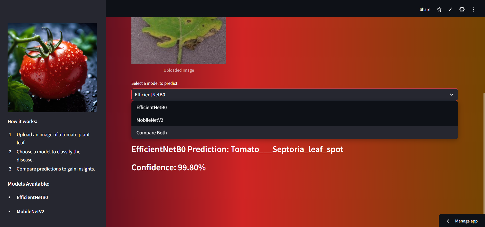

# Tomato Plant Disease Detection System

## Overview

The **Tomato Plant Disease Detection System** uses **machine learning** and **image recognition** to detect and classify diseases in tomato plants. By employing advanced models like **MobileNetV3** and **EfficientNet**, this system reduces crop loss and improves the quality of tomato yields, supporting agricultural experts and farmers with real-time disease detection.

---

## Key Features

- **Real-time Disease Detection**: Upload images of tomato leaves to instantly determine whether the plant is healthy or diseased.
- **Disease Classification**: If the plant is diseased, the system classifies the specific disease type.
- **Machine Learning Models**: The system uses **MobileNetV3** and **EfficientNet**, which are efficient and accurate for image classification tasks.
- **Performance Metrics**: The models' performance is evaluated using metrics such as **accuracy**, **precision**, **recall**, **F1 score**, and **confusion matrix**.
- **User-friendly Web Interface**: Built with **Streamlit**, offering a simple and intuitive interface for easy use by farmers, even with limited technical knowledge.

---

## Project Structure

- **Dataset**: Contains images of healthy and diseased tomato leaves.
- **Preprocessing**: Data preprocessing techniques such as normalization and augmentation to improve model performance.
- **Training**: The models are trained using **TensorFlow** and evaluated with performance metrics.
- **Streamlit Web Application**: The models are deployed using **Streamlit**, providing an interactive user interface for real-time predictions.

---

## Models Used

1. **MobileNetV3**: A lightweight convolutional neural network model optimized for efficiency on mobile devices.
2. **EfficientNet**: A scalable model that balances accuracy with computational efficiency, suitable for large-scale image classification tasks.

---

## How It Works

1. **Upload Image**: Users upload an image of a tomato leaf.
2. **Preprocess Image**: The image is preprocessed for model input (e.g., resizing, normalization).
3. **Disease Prediction**: The trained model predicts if the plant is healthy or diseased and classifies the disease if applicable.
4. **Results Display**: The result is displayed on the Streamlit interface, showing the disease prediction and its probability.

---

## Performance Metrics

The models' performance was evaluated using the following metrics:

- **Accuracy**
- **Precision**

---

## Technologies Used

- **Machine Learning**: TensorFlow
- **Web Framework**: Streamlit
- **Model Architectures**: MobileNetV3, EfficientNet
- **Programming Languages**: Python
- **Data Preprocessing**: OpenCV, NumPy

---

## Installation

1. Clone the repository:

   ```bash
    git@github.com:Nandini-678/ML-Project-on-Tomato-leaf-disease-prediction.git
   ```

2. Install the required dependencies:

   ```bash
   pip install -r requirements.txt
   ```

3. Run the Streamlit application:

   ```bash
   streamlit run app.py
   ```

4. Open the web app in your browser at `http://localhost:8501`.

---

## Screenshots

### Front Page


### Disease Detection Results comparion



---

## Stremlit App link - "https://ml-project-on-tomato-leaf-disease-prediction-iv6npjz7jirwwzpyh.streamlit.app/"
